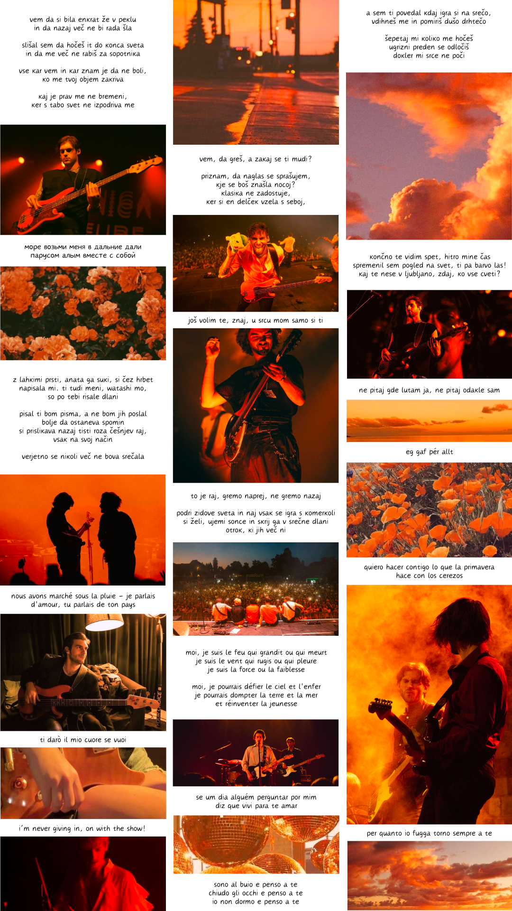

canada, any pronouns, 18+

### [generacija](https://lyricstranslate.com/en/sem-ti-povedal-did-i-ever-tell-you.html) [ljubezni](https://lyricstranslate.com/en/vse-kar-vem-all-i-know.html), [upanja](https://lyricstranslate.com/en/vem-da-gres-i-know-youre-leaving.html-0), [novi](https://lyricstranslate.com/en/tokio-tokyo.html-7) [val](https://lyricstranslate.com/en/ngvot-ne-govoriva-vec-o-tem-wdtaia-we-dont-tal.html)
I survived information theory, paris gare du nord, and the implosion of the [luke black discord server](https://discord.gg/lukeblackmusic)

### нови план други сан
yaba > piton > colchón laboratorio > misql > si > erre > jasquel > prólogo > yabaescrit

### [o](https://open.spotify.com/track/5aSfvfQk6xtnV7fmRKbeKL?si=b646050d100b46c1) [captain](https://www.youtube.com/watch?v=vHuMmb28tkY), [my](https://www.youtube.com/watch?v=oc8JP-yI9fQ) [captain](https://www.youtube.com/watch?v=3LXlPviGiWc)!
I like world languages, soccer, figure skating, les misérables, dnd, stardoo, eurovision, pokémon, typology, maþ, space, bass, and all kinds of music :D

